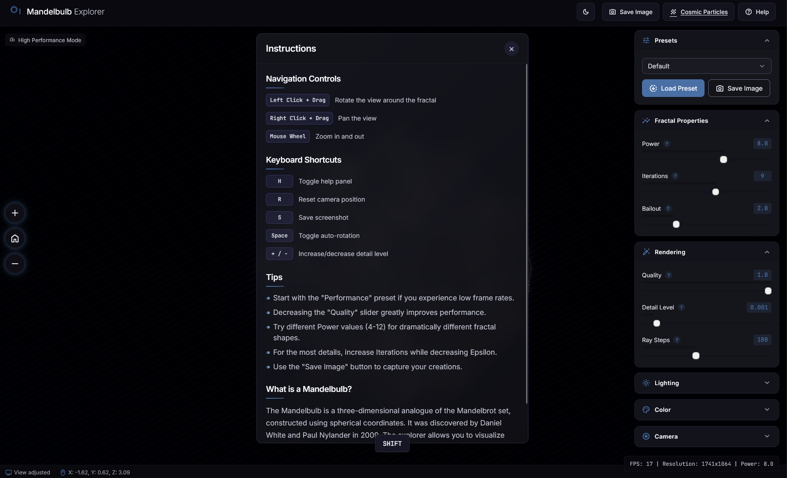
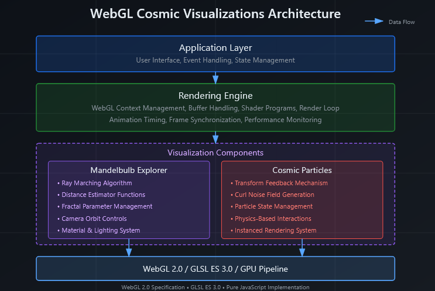
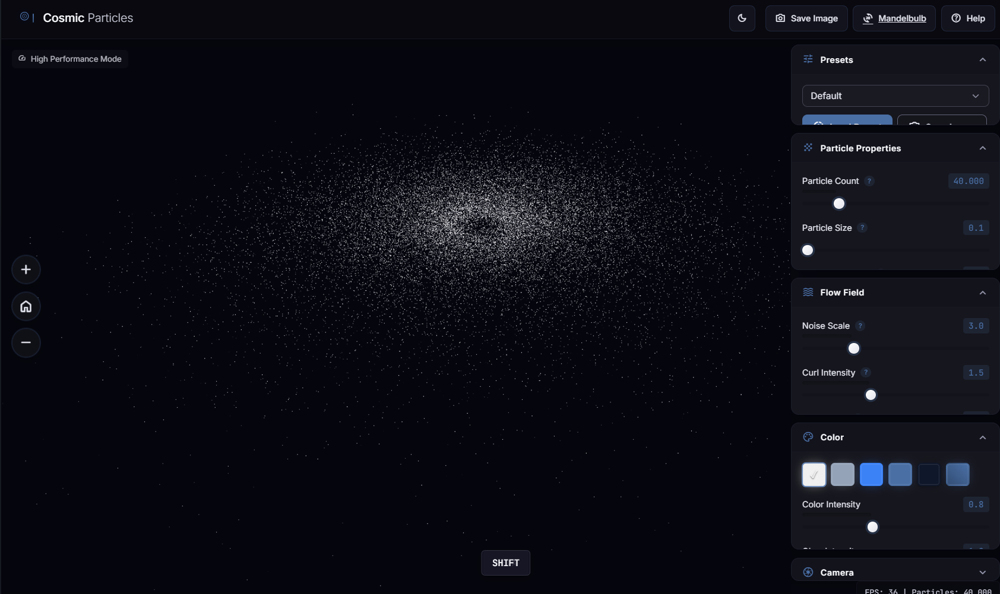

# WebGL Cosmic Visualizations

<div align="center">

<!--  -->

[](LICENSE)
[](https://www.khronos.org/webgl/)
[](<https://www.khronos.org/opengl/wiki/Core_Language_(GLSL)>)
[](https://developer.mozilla.org/en-US/docs/Web/JavaScript)

**An interactive 3D visualization project featuring WebGL-powered fractal and particle simulations**

[Demo](#live-demo) • [Features](#features) • [Screenshots](#screenshots) • [Technologies](#technologies) • [Getting Started](#getting-started) • [Structure](#project-structure)

</div>

## Overview

WebGL Cosmic Visualizations offers high-performance 3D fractal and particle simulations rendered entirely in the browser. The project leverages GPU-accelerated rendering through WebGL and custom GLSL shaders to create mesmerizing cosmic landscapes and particle systems that respond to user interaction in real time.

## Features

<table>
<tr>
  <td width="50%">
    <h3>Mandelbulb Explorer</h3>
    <p>Interactive 3D fractal visualization with ray-marching techniques</p>
    <ul>
      <li>Adjustable fractal parameters (power, iterations, bailout)</li>
      <li>Multiple rendering quality options</li>
      <li>Advanced lighting controls</li>
      <li>Camera manipulation with mouse and keyboard shortcuts</li>
      <li>Animated parameter transitions</li>
      <li>Interactive cross-section views</li>
    </ul>
  </td>
  <td width="50%">
    <h3>Cosmic Particles</h3>
    <p>Fluid particle simulation with curl noise for beautiful cosmic effects</p>
    <ul>
      <li>Galaxy formation with spiral arms</li>
      <li>Multiple visual presets (nebula, galaxy, stardust, energetic flow)</li>
      <li>Physically-inspired particle behavior</li>
      <li>Thousands of interactive particles</li>
      <li>Color gradient customization</li>
      <li>Dynamic forces responding to mouse movements</li>
    </ul>
  </td>
</tr>
</table>

## Live Demo

<div align="center">
  <a href="https://muhkartal.github.io/webGL-cosmicVisualizations/" target="_blank">
    <picture>
  <source media="(prefers-color-scheme: dark)" srcset="fig/live-dark.png">
  <source media="(prefers-color-scheme: light)" srcset="fig/live-light.png">
  
</picture>

<strong>Click the Wisit </strong>

  </a>
</div>

## Screenshots

<div align="center">
  <table>
    <tr>
      <td><picture>
  <source media="(prefers-color-scheme: dark)" srcset="fig/man-dakr.png">
  <source media="(prefers-color-scheme: light)" srcset="fig/man-light.png">
  
</picture></td>
      <td></td>
    </tr>
    <tr>
      <td align="center"><em>Mandelbulb Explorer with detailed lighting</em></td>
      <td align="center"><em>Cosmic Particles simulation with spiral formation</em></td>
    </tr>
  </table>
</div>

## Technologies

<table>
<tr>
  <td width="33%">
    <h3>Rendering</h3>
    <ul>
      <li><strong>WebGL</strong> for GPU-accelerated graphics</li>
      <li><strong>GLSL Shaders</strong> for visual effects and computations</li>
      <li>Custom fragment shaders for ray-marching implementation</li>
      <li>Transform feedback for particle simulations</li>
    </ul>
  </td>
  <td width="33%">
    <h3>Mathematics</h3>
    <ul>
      <li>Fractal mathematics for Mandelbulb generation</li>
      <li>Curl noise algorithms for fluid-like motion</li>
      <li>Quaternion rotations for 3D camera control</li>
      <li>Distance field calculations</li>
    </ul>
  </td>
  <td width="33%">
    <h3>Implementation</h3>
    <ul>
      <li>Pure JavaScript with no external dependencies</li>
      <li>Responsive design using CSS Grid and Flexbox</li>
      <li>Custom UI controls for parameter adjustments</li>
      <li>Web Workers for non-blocking computations</li>
    </ul>
  </td>
</tr>
</table>

### System Architecture

The framework consists of four integrated modules that work together to improve factual consistency:

<picture>
  <source media="(prefers-color-scheme: dark)" srcset="fig/arch-dark.png">
  <source media="(prefers-color-scheme: light)" srcset="fig/arch-light.png">
  
</picture>

## Performance Optimizations

The project includes several optimizations to maintain high frame rates:

-  **Adaptive quality scaling** based on device performance
-  **Temporal anti-aliasing** for smoother visuals
-  **Level-of-detail rendering** for complex fractals
-  **Frustum culling** for particle systems
-  **Instanced rendering** for particle visualization
-  **Texture-based lookup tables** for complex calculations

## Getting Started

### Prerequisites

-  Modern web browser with WebGL 2.0 support
-  Local development server (Python's built-in server, Node.js http-server, etc.)

### Installation

1. Clone the repository:

   ```bash
   git clone https://github.com/your-github-username/webgl-cosmic-visualizations.git
   ```

2. Navigate to the project directory:

   ```bash
   cd webgl-cosmic-visualizations
   ```

3. Start a local server:

   ```bash
   # Using Python (Python 3)
   python -m http.server

   # OR using Node.js http-server (if installed)
   http-server
   ```

4. Open your browser and visit:
   ```
   http://localhost:8000
   ```

### Controls

<details>
<summary><strong>Mandelbulb Controls</strong></summary>

-  **Left Mouse Button + Drag**: Rotate camera
-  **Right Mouse Button + Drag**: Pan camera
-  **Mouse Wheel**: Zoom in/out
-  **R Key**: Reset view
-  **Q/E Keys**: Increase/decrease fractal power
-  **+/- Keys**: Adjust iteration count
-  **Space**: Toggle auto-rotation

</details>

<details>
<summary><strong>Particle System Controls</strong></summary>

-  **Mouse Movement**: Influence particle flow
-  **Left Click**: Create attraction point
-  **Right Click**: Create repulsion point
-  **Mouse Wheel**: Adjust force strength
-  **1-4 Keys**: Select different presets
-  **R Key**: Reset simulation
-  **P Key**: Pause/resume simulation

</details>

## Project Structure

```
webgl-cosmic-visualizations/
├── index.html               # Landing page
├── src/
│   ├── js/
│   │   ├── mandelbulb.js    # Mandelbulb fractal implementation
│   │   ├── cosmicParticles.js # Particle system implementation
│   │   ├── math/            # Math utility functions
│   │   │   ├── matrix.js    # Matrix operations
│   │   │   └── noise.js     # Noise functions
│   │   └── common.js        # Shared functionality
│   ├── css/
│   │   └── styles.css       # Application styles
│   └── shaders/
│       ├── mandelbulb/      # Mandelbulb shaders
│       │   ├── vertex.glsl  # Vertex shader
│       │   └── fragment.glsl # Fragment shader with ray-marching
│       └── particles/       # Particle system shaders
│           ├── compute.glsl # Particle physics computation
│           ├── vertex.glsl  # Particle rendering vertex shader
│           └── fragment.glsl # Particle rendering fragment shader
├── assets/
│   ├── icons/               # UI icons
│   └── fonts/               # Custom fonts
└── pages/
    ├── mandelbulb.html      # Mandelbulb Explorer page
    └── cosmic-particles.html # Cosmic Particles page
```

## Browser Compatibility

<table>
<tr>
  <th>Browser</th>
  <th>Supported Versions</th>
  <th>Notes</th>
</tr>
<tr>
  <td>Chrome</td>
  <td>90+</td>
  <td>Full functionality, best performance</td>
</tr>
<tr>
  <td>Firefox</td>
  <td>88+</td>
  <td>Full functionality</td>
</tr>
<tr>
  <td>Safari</td>
  <td>14+</td>
  <td>May have performance limitations on some effects</td>
</tr>
<tr>
  <td>Edge</td>
  <td>90+</td>
  <td>Full functionality</td>
</tr>
</table>

## Future Development

Planned features for upcoming releases:

-  Additional fractal types (Julia sets, Menger sponge)
-  VR support for immersive exploration
-  Export functionality for high-resolution renders
-  Audio reactivity for visualizations
-  Additional particle presets and behaviors
-  Custom shader editor for experimentation

## Contributing

Contributions are welcome! Please feel free to submit a Pull Request.

1. Fork the repository
2. Create your feature branch (`git checkout -b feature/amazing-feature`)
3. Commit your changes (`git commit -m 'Add amazing feature'`)
4. Push to the branch (`git push origin feature/amazing-feature`)
5. Open a Pull Request

## License

This project is licensed under the MIT License - see the [LICENSE](LICENSE) file for details.

## Acknowledgments

-  Inspired by various WebGL demos and fractal mathematics
-  Special thanks to the WebGL and GLSL community for resources and tutorials
-  Fractal formulations based on research by Daniel White and Paul Nylander
-  Curl noise implementation inspired by Robert Bridson's paper on fluid simulation

---

<div align="center">
  <p>
    <strong>WebGL Cosmic Visualizations</strong> - Explore the beauty of mathematical cosmos
  </p>
  <p>
    <a href="https://github.com/your-github-username/webgl-cosmic-visualizations">GitHub</a> •
    <a href="https://github.com/your-github-username/webgl-cosmic-visualizations/issues">Issues</a> •
    <a href="https://your-github-username.github.io/webgl-cosmic-visualizations/">Demo</a>
  </p>
</div>
<div align="center">
Developed by Muhammad Ibrahim Kartal | [kartal.dev]

</div>
